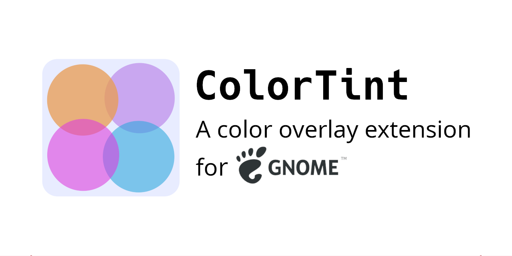

# ColorTint

## About

ColorTint is a Gnome extension that draws a translucent coloured overlay over your desktop. This is
to help people with dyslexia, visual stress, scopic sensitivity, and related conditions.

If you use this extension, please consider starring it on GitHub to help me get a sense of the size of the userbase.
  
### Links

- [GitHub Repository](https://github.com/MattByName/color-tint)
- [GNOME Extensions Page](https://extensions.gnome.org/extension/1789/colortint/)
- [GitHub Releases](https://github.com/MattByName/color-tint/releases)

## Features

- Set any colour using RGB sliders
- Custom translucency through alpha slider
- ColorTint remembers your chosen color, automatically saving it when you change it, and loading on
  launch
- The tint is on by default. Click the colortint icon and toggle "Tint" to enable. Go to settings in
  the Gnome Extensions app to change the default behaviour
- Supports multiple monitor setup

## Installation

The easiest way to install is using the Gnome Extensions website. You can find ColorTint
[here](https://extensions.gnome.org/extension/1789/colortint/)

You can also install ColorTint manually by downloading the [latest
release](https://github.com/MattByName/color-tint/releases) and unzipping it into the Gnome
extensions folder on your desktop. You can find a guide on how to do that
[here](https://www.ubuntubuzz.com/2017/11/how-to-install-manually-gnome-shell-extension.html). You
can also clone this repository and use the terminal command `make install` from the repo root
directory.

## Support
I maintain this extension in my spare time for my own use and because I believe it's an important accessibility feature. If you want to make a small coffee- or beer-sized donation, here are some ways to do so. Please don't send anything larger, other projects need it more.
- 
## Contributing
Please do contribute if you want to change something or help out with one of the issues.

## Feature Requests and Bug Reports

Please [raise an issue](https://github.com/MattByName/color-tint/issues/new) or make a pull
request. Alternatively, you can contact me via matrix at
[@mattbyname:matrix.org](https://matrix.to/#/@mattbyname:matrix.org)

## Support for GNOME versions

I attempt to maintain backwards compatibility, but if an upgrade breaks support for a release that
has reached end of life, I will update the table below to show which version of ColorTint was last
verified to work with it.

The version of this table in the package available through the GNOME Extensions website will be
slightly out of date compared to github.

| GNOME Releases | ColorTint Releases                                                     | Extension Site version |
| :------------- | :--------------------------------------------------------------------- | :--------------------- |
| 45             | [latest](https://github.com/MattByName/color-tint/releases/latest)     | 21                     |
| 44             | [v2.3.1](https://github.com/MattByName/color-tint/releases/tag/v2.3.1) | 19                     |
| 43             | [v2.3.1](https://github.com/MattByName/color-tint/releases/tag/v2.3.1) | 19                     |
| 42             | [v2.3.1](https://github.com/MattByName/color-tint/releases/tag/v2.3.1) | 19                     |
| 41             | [v2.2.2](https://github.com/MattByName/color-tint/releases/tag/v2.2.2) | 14                     |
| 40             | [v2.2.2](https://github.com/MattByName/color-tint/releases/tag/v2.2.2) | 14                     |
| 3.38           | [v2.2.2](https://github.com/MattByName/color-tint/releases/tag/v2.2.2) | 14                     |
| 3.36           | [v2.2.2](https://github.com/MattByName/color-tint/releases/tag/v2.2.2) | 14                     |
| 3.34           | [v1.1.1](https://github.com/MattByName/color-tint/releases/tag/v1.1.1) | 4                      |
| 3.32           | [v1.1.1](https://github.com/MattByName/color-tint/releases/tag/v1.1.1) | 4                      |
